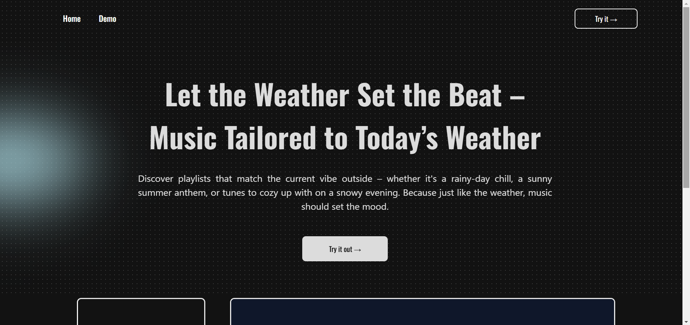
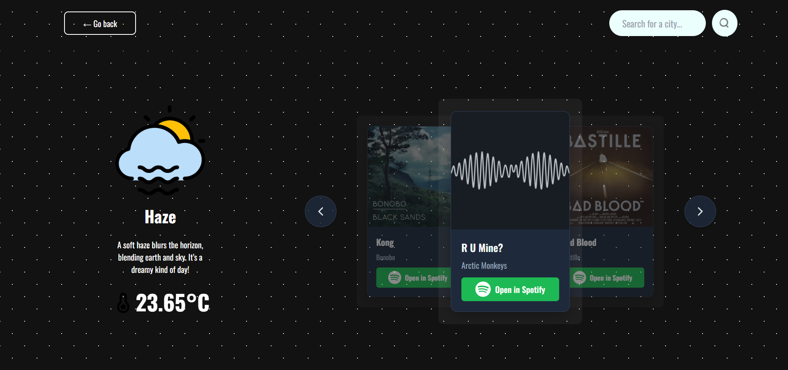
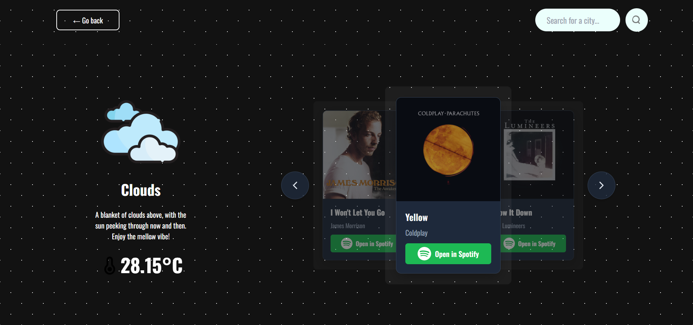

<h1>BeatForecast</h1>
BeatForecast aims to enhance your music experience by syncing your playlist with the current weather. It uses real-time weather data to serve you curated music recommendations that match the mood of the day.

<h1>Live Demo</h1>
Try it out here: https://beatforecast.com/  

<h1>Highlights</h1>
<ul>
  <li>🎵 Weather-Based Playlists: Curated music recommendations based on the current weather.</li>
  <li>🌦 Real-Time Weather Integration: Pulls weather data from a reliable weather API.</li>
  <li>📱 Responsive Design: Fully responsive web app that looks great on any device.</li>
  <li>🌎 Geolocation Support: Automatically detects your location for accurate local weather updates.</li>
  <li>🎨 User-Friendly Interface: Simple and intuitive UI for a seamless experience.</li>
  <li>🌄 Dynamic Playlists: Different playlists for sunny, rainy, snowy, and windy conditions.</li>
  <li>🍂 Seasonal Vibes: Special playlists based on the season for an added touch.</li>
</ul>

<h1>Tech Stack</h1>
<ul>
  <li>FrontEnd: ReactJS (using vite)</li>
  <li>Styling: Tailwind CSS</li>
  <li>API integrations: OpenWeather API & Spotify API</li>
  <li>Package Manager: npm</li>
  <li>Build tool: Vite</li>
</ul>

<h1>Usage</h1>
<ul>
  <li>Visit the app and allow it to detect your location</li>
  <li>View weather-based playlists that are dynamically generated based on the local weather</li>
  <li>Select and play any song from the recommended list directly</li>
  <li>See the weather and music recommendations for different locations by searching it using the search bar</li>
</ul>

<h1>Demo</h1>
Home page:

 
Weather demo:

 

<h1>Contact</h1>
For suggestions/improvement, feel free to contact me!
